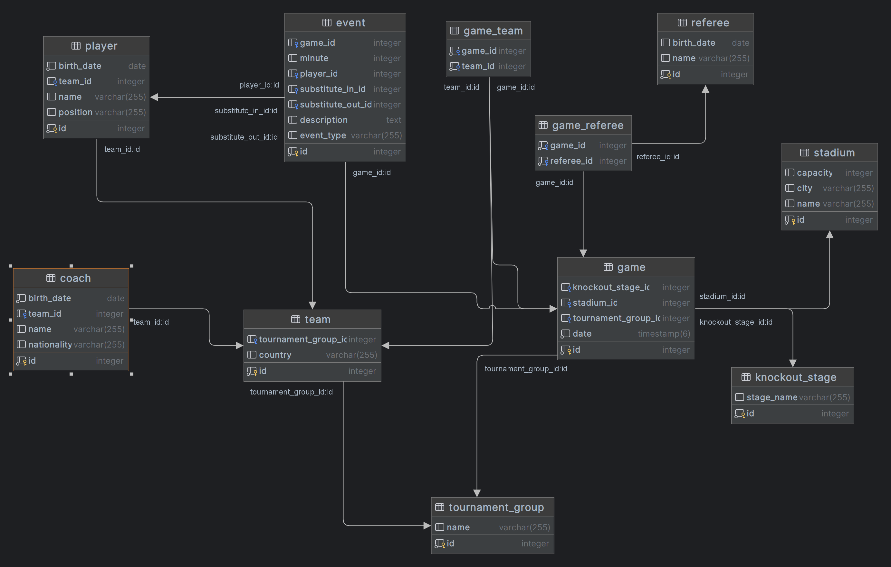

# Football Euro 2024 API Tutorial

## Introduction

Welcome to the Football Euro 2024 API project! This tutorial is designed to help you build a Spring Boot application
that serves as an API for managing the Euro 2024 football tournament data. By the end of this tutorial, you'll have a
solid understanding of Spring Boot, JPA, and how to create and interact with RESTful APIs.

## Project

This project is a Spring Boot-based API for managing data related to the Euro 2024 football tournament. It includes
features for handling tournament groups, teams, players, games, and events. The purpose of this tutorial is to
demonstrate how to set up a Spring Boot application, create entities, set up JPA repositories, and build RESTful
endpoints.

## UML

## Tutorial

You can find the tutorial
here : https://docs.google.com/document/d/1DjW-lKgjPnVSdeLiyoP-S9s2-uiSHqqxY-Kwx76_KOw/edit?usp=sharing

## Note

The tutorial and the project still in progress, I will update it as soon as possible.

## Future Work

- Add Authentication with Spring security
- Add Swagger for API documentation
- Add Unit and Integration tests
- Add Specification for filtering data